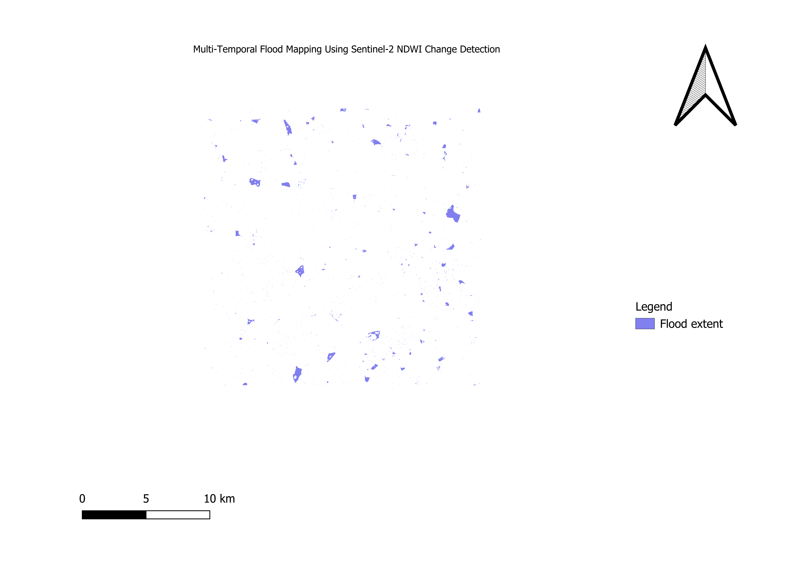

# 🌍 Geo-FM: Multi-Temporal Flood Mapping Using Sentinel-2 NDWI Change Detection

## 📌 Overview

Geo-FM is a geospatial data engineering project demonstrating an end-to-end workflow for multi-temporal flood mapping using Sentinel-2 satellite imagery. The project focuses on scalable geospatial data preparation, quality assessment, representative sampling, cloud-ready raster storage, and flood extent mapping using NDWI change detection.

The workflow integrates Google Earth Engine, Python, Xarray, Dask, Zarr, Rasterio, and QGIS to build a reproducible geospatial processing pipeline suitable for remote sensing and Earth observation applications.

---

## 🎯 Objectives

- Develop a scalable geospatial data engineering workflow
- Automate metadata extraction and quality assessment
- Generate representative image samples
- Build multidimensional raster data cubes
- Perform parallel raster processing
- Store datasets in cloud-ready Zarr format
- Benchmark dataset quality using GeoPrepBench
- Detect flood extent using multi-temporal NDWI
- Visualize results using QGIS

---

## 🛰️ Study Area

**Location:** Pakistan

**Satellite:** Sentinel-2 Level-2A Surface Reflectance

**Application:** Flood Extent Mapping

---

## 🌊 Flood Extent Map



---

## ⚙️ Workflow

```text
Sentinel-2 Images
        │
        ▼
Metadata Extraction
        │
        ▼
Quality Assessment
        │
        ▼
Representative Sampling
        │
        ▼
Xarray Data Cube
        │
        ▼
Parallel Processing with Dask
        │
        ▼
Zarr Storage
        │
        ▼
GeoPrepBench Evaluation
        │
        ▼
NDWI Change Detection
        │
        ▼
Flood Mask Generation
        │
        ▼
QGIS Visualization
```

---

## 🛠 Technologies Used

| Category | Technologies |
|----------|--------------|
| Programming | Python |
| Cloud Platform | Google Earth Engine |
| GIS | QGIS |
| Raster Processing | Rasterio, Rioxarray |
| Data Cubes | Xarray |
| Parallel Computing | Dask |
| Storage | Zarr |
| Numerical Computing | NumPy |
| Benchmarking | GeoPrepBench |

---

## 📂 Repository Structure

```
Geo-FM/
│
├── config/
│
├── data/
│   ├── raw/
│   ├── metadata/
│   ├── curated/
│   └── benchmark/
│
├── docs/
│
├── outputs/
│   ├── FloodMask.tif
│   ├── NDWI.tif
│   ├── metadata_report.csv
│   ├── quality_report.csv
│   └── geoprepbench_report.csv
│
├── screenshots/
│   └── FloodMap.png
│
├── src/
│   ├── metadata.py
│   ├── quality.py
│   ├── sampling.py
│   ├── datacube.py
│   ├── dask_pipeline.py
│   ├── zarr_export.py
│   ├── geoprepbench.py
│   └── flood_mapping.py
│
├── README.md
├── requirements.txt
└── .gitignore
```

---

## 🔬 Methodology

### 1. Metadata Extraction

Satellite image metadata were extracted to organize the dataset and improve reproducibility.

### 2. Quality Assessment

Image quality was evaluated using geographic diversity, biome diversity, cloud cover, and temporal distribution.

### 3. Representative Sampling

A representative sampling strategy was designed to improve spatial coverage and reduce sampling bias.

### 4. Data Cube Construction

Raster datasets were converted into multidimensional Xarray Data Cubes for efficient geospatial analysis.

### 5. Parallel Processing

Large raster datasets were processed using Dask to enable scalable computation.

### 6. Cloud-Ready Storage

Processed datasets were stored in Zarr format for efficient access and compatibility with modern geospatial workflows.

### 7. Dataset Benchmarking

GeoPrepBench was used to evaluate dataset readiness and overall quality.

### 8. Flood Mapping

Flood extent was detected using multi-temporal NDWI change detection derived from Sentinel-2 imagery.

### 9. Visualization

Flood extent maps were visualized and exported using QGIS.

---

## 📊 Outputs

The project produces:

- Metadata Report
- Quality Assessment Report
- GeoPrepBench Report
- NDWI Raster
- Binary Flood Mask
- Flood Extent Map

---

## 💡 Skills Demonstrated

- Geospatial Data Engineering
- Remote Sensing
- Satellite Image Processing
- Raster Data Management
- Xarray Data Cubes
- Parallel Computing with Dask
- Cloud-Ready Geospatial Storage
- Flood Mapping
- GIS Visualization
- Python Development
- Reproducible Geospatial Workflows

---

## 🚀 Future Improvements

- Sentinel-1 SAR flood mapping
- U-Net based flood segmentation
- Foundation Models for Earth Observation
- STAC Catalog integration
- Cloud Optimized GeoTIFF (COG) generation
- Automatic flood area estimation by administrative boundary
- Interactive web map visualization

---

## ▶️ How to Run

### Clone the repository

```bash
git clone https://github.com/<your-username>/Geo-FM.git
cd Geo-FM
```

### Create a virtual environment

```bash
python -m venv .venv
```

### Activate the environment

Windows:

```bash
.venv\Scripts\activate
```

Linux/macOS:

```bash
source .venv/bin/activate
```

### Install dependencies

```bash
pip install -r requirements.txt
```

### Run the workflow

```bash
python src/metadata.py
python src/quality.py
python src/sampling.py
python src/datacube.py
python src/dask_pipeline.py
python src/zarr_export.py
python src/geoprepbench.py
python src/flood_mapping.py
```

---

## 👩‍💻 Author

**Nivedita Vee**

Geospatial Data Science | Remote Sensing | GIS | Python | Machine Learning

---

## ⭐ Acknowledgements

- Google Earth Engine
- European Space Agency (Sentinel-2)
- QGIS Community
- Python Geospatial Ecosystem
